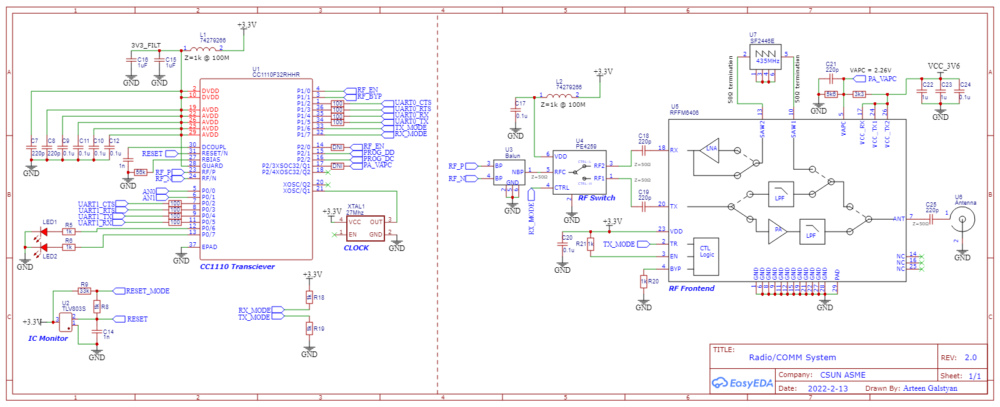

# Radio

> Note: this is a work in progress project that is a part of a larger project for building a fully operational cube satellite.

The radio is designed is to operate in the 432-438 MHz US amateur radio UHF band provided by the FCC. A valid FCC license is required to transmit on this bandwidth.

### Block Diagram

### Circuit Diagram

### TODO

- [x] Block Diagram
- [x] Circuit Schematic
- [ ] Port to Altium Designer
- [ ] 4-layer pcb layout
- [ ] Firmware
- [ ] Testing
